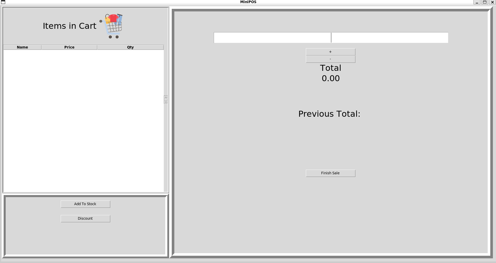
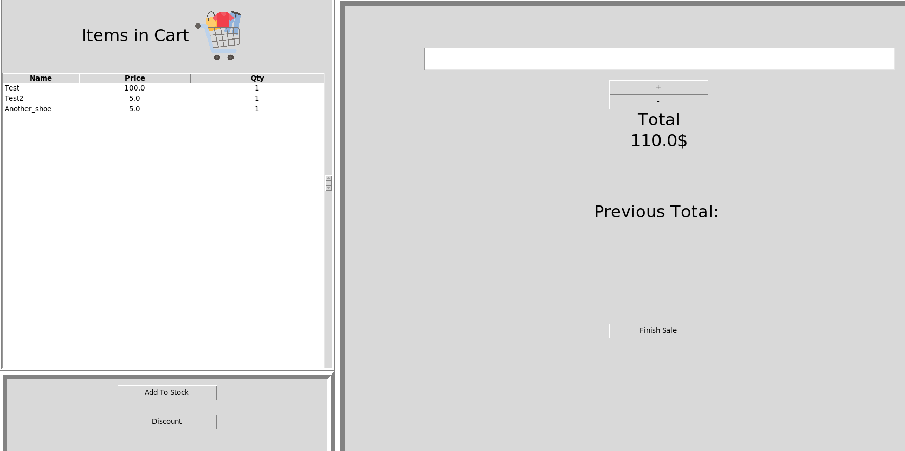
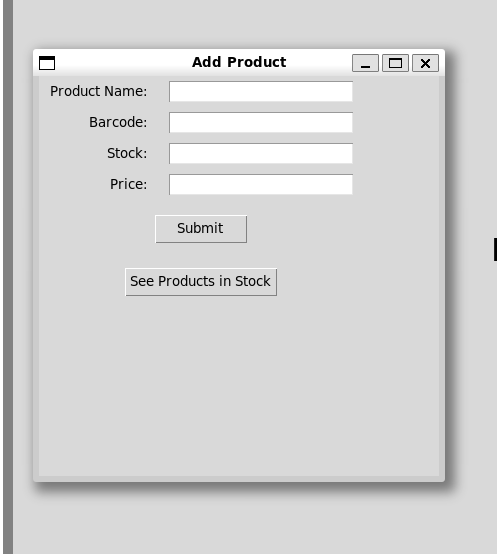
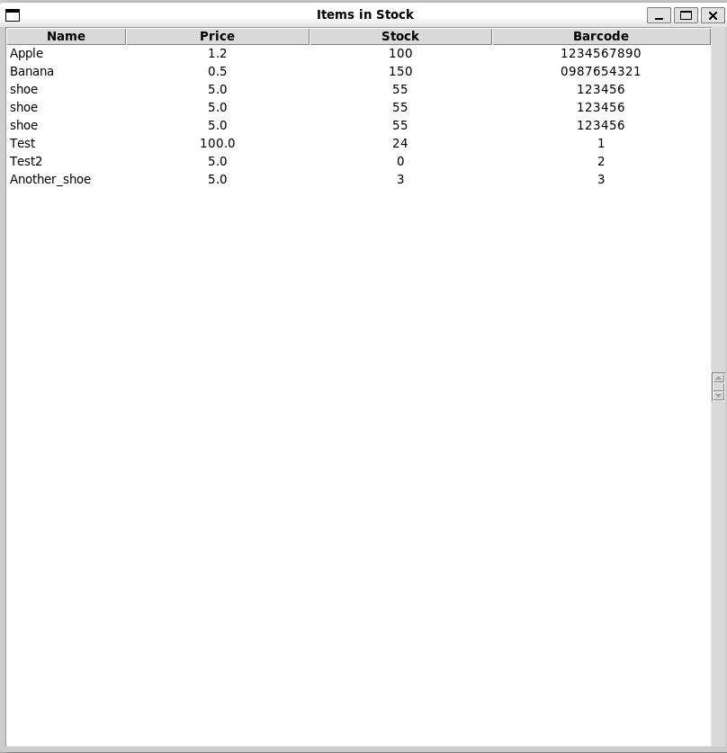

# 🧾 MiniPOS – A Minimal Point of Sale System

A simple yet functional Point of Sale (POS) desktop application written in Python using `tkinter` and `sqlite3`.

---

## 🚀 Features

- 📦 Add products to a virtual cart using a barcode
- ➖ Decrease quantity or remove items from the cart
- 💰 See live total price as you add/remove items
- 🔄 Automatically update product stock after each sale
- 🗃 Persistent database using SQLite
- 🖼 Simple GUI with `tkinter`

---

## 🛠 How to Run

1. Clone the repository:

git clone https://github.com/yourusername/minipos.git
cd minipos/python

python3 main.py

🧑‍💼 How to Use
1.Start the app.

2.Add products to the database or load them from the DB.

3.Enter the product's barcode and add it to the cart. (By pressing enter)

4.View the running total.

5.Complete the sale – the stock of each product is updated accordingly.

🧠 What I Learned
Building GUIs using tkinter

Managing application state with classes

Connecting to SQLite databases in Python

Executing SQL transactions and updates

Separating logic into modules (cart.py, db.py, etc.)

Avoiding circular imports

Writing MVP-level functional apps without overengineering

🔮 Future Improvements
 Make a working discount button (Now it's just for visual)

 Add stock checks before adding to the cart

 Display error messages for invalid barcodes or empty stock

 Style the UI with colors, fonts, and layout improvements

 Save sales history (with timestamps) to a sales table

 Implement receipt printing or exporting to PDF

 Add authentication (e.g., cashier login)

📷 Screenshots 

📚 Technologies Used
Python 3

tkinter – GUI toolkit

sqlite3 – lightweight database engine

🗑️🧠 Personal Notes
This was the first thing, I built alone by myself from scratch. 
It needs a ton of refactoring, better separation of concerns but I think it fits the requirement of boot.dev (First Personal Project)

